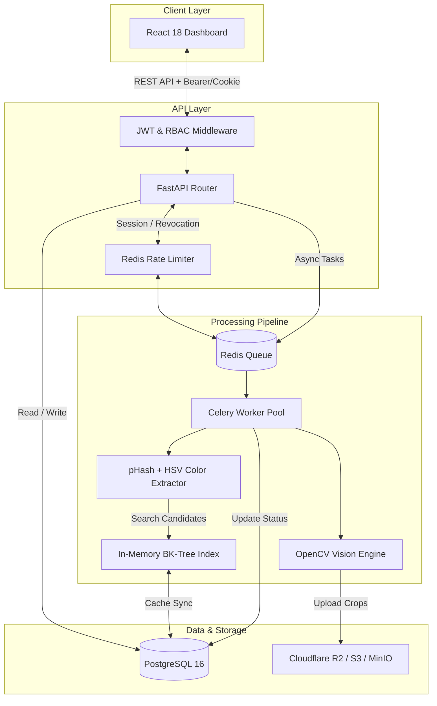

# CardFlow 🃏
> **Automated Card Processing, Edge-Detection Cropping & Rotation-Invariant Deduplication Engine**

[](https://github.com/Astral420/CardFlow/actions)
[](https://github.com/Astral420/CardFlow/actions)
[](https://fastapi.tiangolo.com)
[](https://reactjs.org/)
[](https://www.typescriptlang.org/)
[](https://www.python.org/)
[](https://www.postgresql.org/)
[](https://redis.io/)
[](https://tailwindcss.com/)

---

## 📌 Overview

**CardFlow** is a high-performance, full-stack trading card intake and deduplication management system built to streamline high-volume card scanning workflows. 

By replacing manual OS image viewers and informal spreadsheet tracking, CardFlow automates raw scan extractions, computer-vision edge cropping, hotkey-assisted orientation verification, and rotation-invariant duplicate detection across historical collections.

---

## ✨ Key Features

### ⚡ Computer Vision & Edge Cropping Engine
* **Automated Contour Detection:** Uses OpenCV Otsu thresholding, `findContours`, `minAreaRect`, and perspective transforms to crop raw scans tightly to card edges.
* **Aspect-Ratio Guard:** Verifies detected contours against standard trading card proportions (`~2.5:3.5`), flagging out-of-tolerance crops for manual review before bad crops can corrupt downstream perceptual hashing.
* **Pre-cropped Auto-Detection:** Automatically detects intake scans that are already tight to the frame (e.g. device auto-crops or sleeves) via perimeter background ratio checks, applying tailored validation rules.

### 🔄 Hotkey-Driven Rotation Review Queue
* **Fast Ergonomic Review:** Displays front and back crops side-by-side with hotkey controls (`Space` to confirm, `R` to rotate 180°) for rapid human verification.
* **Batch Auto-Advancing:** Instantly advances to the next pair upon confirmation, triggering async hashing tasks without blocking UI responsiveness.

### 🧠 Dual-Signal Rotation-Invariant Deduplication
* **Multi-Orientation Perceptual Hashing:** Front images are hashed at four orthogonal rotations (`0°`, `90°`, `180°`, `270°`) using pHash/dHash.
* **Region-Sampled HSV Color Signatures:** Extracts region-specific HSV color histograms (focusing on borders and corners) to distinguish color variants, parallels, and foils from standard prints.
* **BK-Tree Metric Indexing:** Built-in process-cached Burkhard-Keller tree index accelerates cross-batch nearest-neighbor queries via Hamming distance in sub-linear $O(\log N)$ time.
* **Filename Tie-Breakers:** Uses original filenames as candidate tie-breakers without gating candidate generation.

### 🔍 Human-in-the-Loop Duplicate Review & Audit Log
* **Visual & Quantitative Comparison:** Side-by-side candidate review UI detailing structural distance, HSV color similarity, and scan metadata.
* **Audited Decision History:** Every duplicate confirmation or rejection records the operator ID, user role, and exact timestamp.

### 📊 Modern Web Dashboard
* **Built with React 18 + Vite:** Fast, responsive UI powered by Tailwind CSS, Radix UI primitives, Lucide icons, and light/dark theme modes.
* **Live System Monitoring:** Real-time progress bars, batch queue counters, and system health status indicators (Postgres, Redis, Celery).
* **Card Log & ZIP Export:** Centralized searchable catalog of all processed cards with direct batch ZIP download capabilities.

---

## 🏗️ System Architecture



---

## 🛠️ Tech Stack

| Layer | Technology / Tool | Purpose |
|---|---|---|
| **Backend Framework** | [FastAPI](https://fastapi.tiangolo.com/) | Async REST API, OpenAPI docs, Pydantic schemas |
| **Async Tasks** | [Celery](https://docs.celeryq.dev/) + [Redis](https://redis.io/) | Background zip extraction, cropping, hashing, dedup matching |
| **Vision & Image Processing** | OpenCV, Pillow, [ImageHash](https://github.com/JohannesBuchner/imagehash) | Contour extraction, perspective warp, pHash, HSV color signatures |
| **Database** | PostgreSQL 16 + [SQLAlchemy 2.0](https://www.sqlalchemy.org/) | Relational persistence, indexing, audit log |
| **Database Migrations** | [Alembic](https://alembic.sqlalchemy.org/) | Schema migrations & RBAC version control |
| **Object Storage** | Cloudflare R2 or AWS S3 | Scalable storage for raw scans and cropped card assets |
| **Frontend UI** | React 18, Vite, TypeScript, Tailwind CSS | High-performance dashboard, hotkey queues, dark mode |
| **State & Navigation** | React Router 6, Lucide Icons | Client-side routing, modern icons |
| **Containerization** | Docker, Docker Compose | Production & development environment orchestration |
| **CI/CD** | GitHub Actions, GHCR | Automated linting, pytest suite, Vite build, automated deployment |

---

## 🔄 End-to-End Processing Workflow

1. **Batch Upload (`POST /api/batches`):** Operator uploads a `.zip` archive containing paired scan files named according to client convention (`{id}-front.jpg` and `{id}-back.jpg`).
2. **Async Extraction:** Celery unzips files, pairs front/back scans into `raw_scans` table entries, uploads originals to R2, and dispatches individual `crop_scan` tasks.
3. **Edge Crop & Safety Check:** OpenCV detects card contours on scan backgrounds. Valid crops are perspective-warped to standard output dimensions (`750x1050px`) and uploaded to R2. Out-of-tolerance aspect ratios flag `crop_failed` for manual handling.
4. **Rotation Review:** Reviewers use hotkeys to review front/back crop pairs in the dashboard, flip orientation if inverted (`180°`), and confirm.
5. **Perceptual Hashing & Color Indexing:** Upon confirmation, front images are hashed at `0°`, `90°`, `180°`, and `270°` for pHash/dHash and region-sampled HSV histograms.
6. **BK-Tree Candidate Matching:** New cards are queried against the process-cached BK-tree index over historical structural hashes. High-matching candidates undergo HSV color signature verification.
7. **Duplicate Review UI:** Candidate pairs flagged above threshold appear in the duplicate review queue for side-by-side human confirmation (`confirmed_duplicate` vs `rejected`).
8. **Permanent Card Log:** Confirmed entries are indexed in the searchable card log for filtering, audit tracking, and ZIP batch exports.

---

## 🚀 Getting Started

### Prerequisites
* **Docker & Docker Compose** (recommended for database & redis)
* **Python 3.11+**
* **Node.js 18+ & npm**

---

### 💻 Local Development Setup

#### 1. Clone the repository & set up environment variables
```bash
git clone https://github.com/Astral420/CardFlow.git
cd CardFlow

# Copy environment template for backend
cp backend/.env.example backend/.env
```

#### 2. Start PostgreSQL & Redis services
```bash
docker compose up -d postgres redis
```

#### 3. Setup Python virtual environment & backend dependencies
```bash
python -m venv backend/.venv

# Windows (PowerShell):
backend\.venv\Scripts\Activate.ps1
# macOS/Linux:
# source backend/.venv/bin/activate

pip install --upgrade pip
pip install -r backend/requirements.txt
```

#### 4. Run database migrations & seed initial admin user
```bash
# Run migrations from root
python -c "import os; os.chdir('backend'); from alembic.config import main; main(argv=['upgrade', 'head'])"

# Seed default admin user
cd backend
python scripts/seed_users.py "AdminUser" admin
cd ..
```

#### 5. Start API server & Celery worker
In Terminal 1 (API Server):
```bash
cd backend
python -m uvicorn app.main:app --reload --port 8000
```

In Terminal 2 (Celery Worker):
```bash
cd backend
# Windows requires --pool=solo
celery -A app.celery_app worker --loglevel=info --pool=solo
```

#### 6. Setup & start Frontend application
In Terminal 3 (Frontend):
```bash
cd frontend
npm install
npm run dev
```
Open **http://localhost:5173** in your browser and log in with your configured app passcode (defaults to `change-me` in `.env.example`).

---

## 🧪 Testing & Verification

### Running Automated Tests
The repository includes comprehensive unit and integration test suites covering auth rate-limiting, RBAC permissions, crop edge-cases, rotation workflows, token revocation, BK-tree cache sync, and ZIP export logic.

```bash
# Run backend pytest suite
cd backend
pytest -v

# Run frontend build & lint checks
cd frontend
npm run build
```

---

## 📡 Key API Endpoints

| Endpoint | Method | Role Required | Description |
|---|---|---|---|
| `/api/auth/login` | `POST` | Public | Authenticates user with passcode & display name; sets refresh cookie |
| `/api/auth/refresh` | `POST` | Public | Exchanges httpOnly refresh cookie for a new JWT access token |
| `/api/auth/logout` | `POST` | Authenticated | Revokes current JWT access token and clears refresh cookie |
| `/api/users` | `GET` / `POST` | `admin` | List all system users or create new users with specific roles |
| `/api/batches` | `GET` / `POST` | `operator` | List batches or upload a new scan archive `.zip` |
| `/api/batches/{id}/export-zip` | `POST` | `operator` | Generates a downloadable ZIP of cropped card images |
| `/api/review/rotation/next` | `GET` | `reviewer` | Fetches the next unconfirmed front/back crop pair for rotation review |
| `/api/review/rotation/{crop_id}/rotate` | `POST` | `reviewer` | Flips crop image orientation by 180° |
| `/api/review/rotation/{crop_id}/confirm` | `POST` | `reviewer` | Confirms crop orientation and triggers hashing pipeline |
| `/api/review/duplicates/next` | `GET` | `reviewer` | Fetches the next flagged duplicate candidate pair |
| `/api/review/duplicates/{id}/decision` | `POST` | `reviewer` | Confirms (`confirmed_duplicate`) or rejects (`rejected`) candidate pair |
| `/api/cards` | `GET` | Authenticated | Search, filter, and paginate through processed card crops |
| `/api/health` | `GET` | Public | Returns API service operational status |

---

## ⚙️ Empirical Tuning Parameters

CardFlow exposes key computer vision and deduplication parameters in `backend/app/config.py` (or via environment variables) for fine-tuning against specific scan hardware or card sets:

```ini
# Crop Pipeline Safety Controls
CROP_OUTPUT_WIDTH=750
CROP_OUTPUT_HEIGHT=1050
EXPECTED_CARD_ASPECT_RATIO=1.4 # (3.5 / 2.5)
ASPECT_RATIO_TOLERANCE=0.15   # Max allowed variance before flagging crop_failed
PRECROPPED_PERIMETER_BG_MAX_FRACTION=0.8 # Border threshold for pre-cropped detection

# Duplicate Detection Thresholds
STRUCTURAL_HASH_MAX_DISTANCE=10 # Max Hamming distance (out of 64 bits) to consider structural match
COLOR_SIG_MAX_DISTANCE=0.20     # Max HSV histogram distance (0.0 = identical, 1.0 = distinct)
```

---

## 🐳 Production Deployment

CardFlow comes pre-configured for containerized production deployment using Docker Compose:

```bash
# Build and run production containers
docker compose -f docker-compose.prod.yml up -d --build
```

### GitHub Actions CI/CD Pipeline
- **`backend-test.yml`:** Automated pytest suite execution on push/PR to `main`.
- **`frontend-ci.yml`:** Vite build validation and TypeScript verification.
- **`backend-deploy.yml`:** Builds Docker images, pushes them to GitHub Container Registry (GHCR), and deploys via SSH to production servers (e.g., Oracle Cloud Free Tier).

---

## 📁 Repository Structure

```
CardFlow/
├── .github/workflows/          # GitHub Actions CI/CD workflows
│   ├── backend-deploy.yml      # GHCR container build & deployment
│   ├── backend-test.yml        # Pytest backend test suite
│   └── frontend-ci.yml         # Frontend build validation
├── backend/
│   ├── alembic/                # Database schema migrations
│   ├── app/
│   │   ├── api/                # FastAPI routers (auth, batches, cards, duplicates, rotation, users)
│   │   ├── dedup/              # BK-tree metric index & candidate matching algorithms
│   │   ├── models/             # SQLAlchemy ORM models (Batch, RawScan, CardCrop, Candidate, User)
│   │   ├── tasks/              # Celery tasks (unzip, crop, hash, deduplicate)
│   │   ├── vision/             # OpenCV cropping, Otsu thresholding, pHash & HSV color processing
│   │   ├── config.py           # Pydantic environment configuration
│   │   ├── main.py             # FastAPI app initialization & CORS setup
│   │   └── security.py         # JWT tokens, RBAC permission guards, passcodes
│   ├── scripts/                # Database seed scripts
│   ├── tests/                  # Pytest test suite
│   ├── Dockerfile              # Backend container definition
│   └── requirements.txt        # Python package dependencies
├── frontend/
│   ├── public/                 # Favicon and static assets
│   ├── src/
│   │   ├── components/         # UI components (Layout, AppShell, Sidebar, Shared dialogs)
│   │   ├── hooks/              # Custom React hooks (theme, sidebar, health)
│   │   ├── lib/                # API client, auth context, TypeScript definitions
│   │   ├── pages/              # Dashboard, Batches, Rotation, Duplicates, Card Log, Settings
│   │   └── App.tsx             # React Router routing & Protected routes
│   ├── package.json            # Node.js dependencies
│   ├── tailwind.config.ts      # Tailwind CSS styling configuration
│   └── vite.config.ts          # Vite build configuration
├── docker-compose.yml          # Local development stack (Postgres + Redis + API + Worker)
├── docker-compose.prod.yml     # Production Docker Compose stack
├── PLAN.md                     # Project task roadmap & phase tracking
└── TESTING.md                  # Manual curl test walkthrough & verification guide
```

